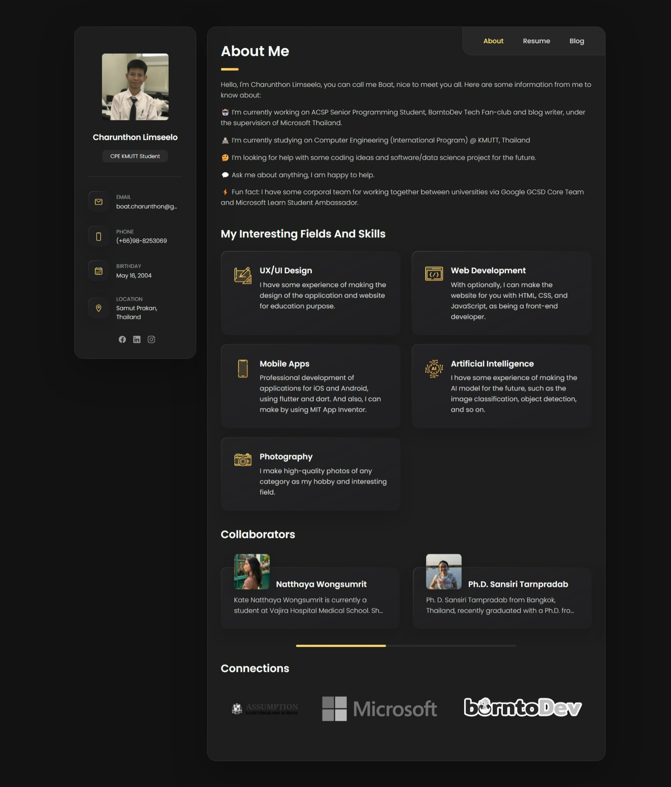

# personal-site

## Introduction
Hi, My name is Charunthon Limseelo. Actually, this is my first website to create for my personalization and
personal cv. By during the time that I study on web development, I decided to create my own website to show my
skill and my experience to the world. I hope you enjoy my website and I hope you will get some idea from my website.

This website is created by using HTML, CSS, and JavaScript. I use the bootstrap framework to help me to design my website.
I use the font-awesome to help me to design my website, which I actually use the google font to help me to design my website.
Also, there is no need to worry about the responsive of my website because I use the bootstrap framework to help me to design, and
no need to install any software to run my website because I use the GitHub page to help me to run my website, also I just install only
visual studio code to help me to code my website.

## How to run my website
you can run my website by click on this link: https://boatchrnthn.vercel.app/

## How to use my website
- You can click on the navigation bar to go to the page that you want to go.

## How to contact me
- You can contact me by email: boat.charunthon@gmail.com

### I don't let anyone to code my website without my permission

## License
[MIT](https://choosealicense.com/licenses/mit/)

## Demo Image

